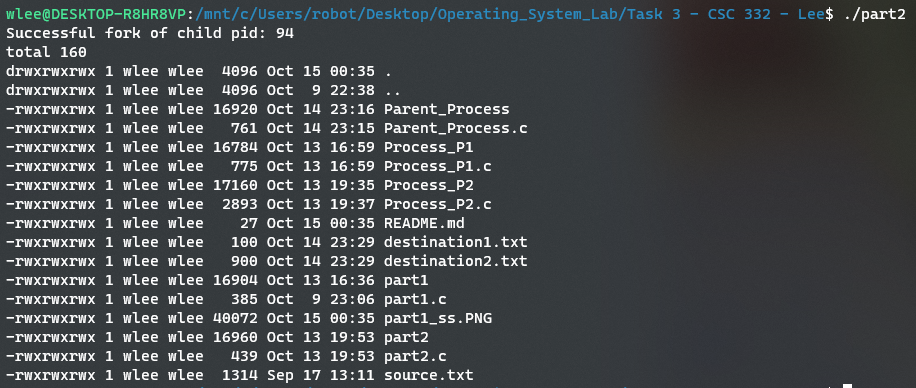

# Task 3 
## William Lee 

Screenshot of Part 1 output: Displays child pid & date time 

Screenshot of Part 2 output: Displays child pid & all files/directories along with permission(including hidden ones)

Part 3 output can be seen in destination1.txt and destination2.txt files.
