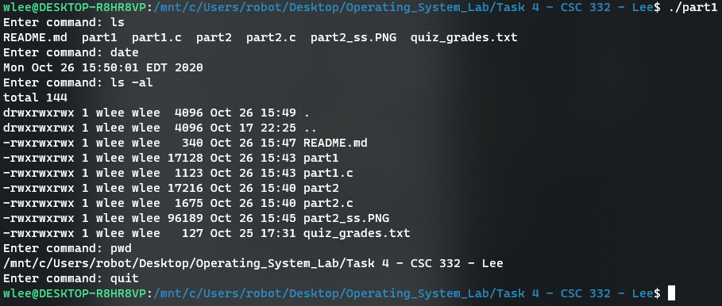
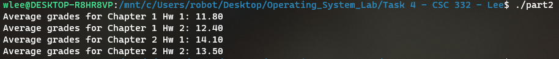

# Task 4 
## William Lee 

Screenshot of Part 1 output: Command Interpreter is able to run linux commands such as ls, date, ls -al, pwd, etc and exits upon "quit". 

Screenshot of Part 2 output: Each worker process prints out the average quiz grade for its respective chapter and quiz

