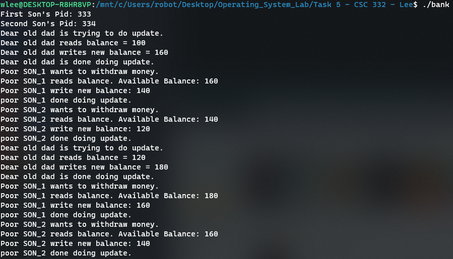
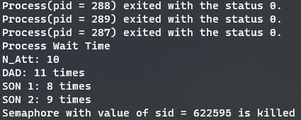
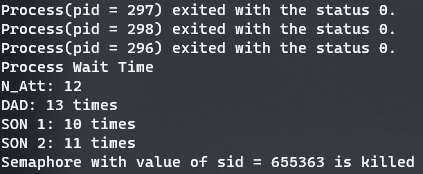
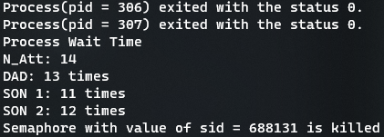
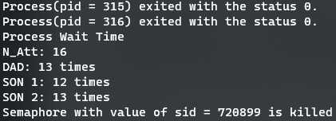
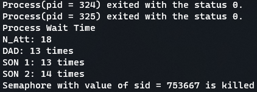
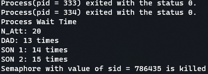

# Task 5 - Process Synchronization 
## William Lee 

Screenshot of Part 1 

Here with the implmentation of synchronization through semaphores in part 1, you can see that each process is able to complete their update to the bank without getting overwritten by another process. 

***

Screenshot of Part 2, N = 10 

Screenshot of Part 2, N = 12 

Screenshot of Part 2, N = 14 

Screenshot of Part 2, N = 16 

Screenshot of Part 2, N = 18 

Screenshot of Part 2, N = 20 

Here N is the number of attempts the son processes can update the bank account, the dad process is constant at 5 attempts. The screenshots show the output of the amount of times each process waited during the execution of the entire program. 

*** 
### Report 

Note: The report is in the file "report.pdf" 
