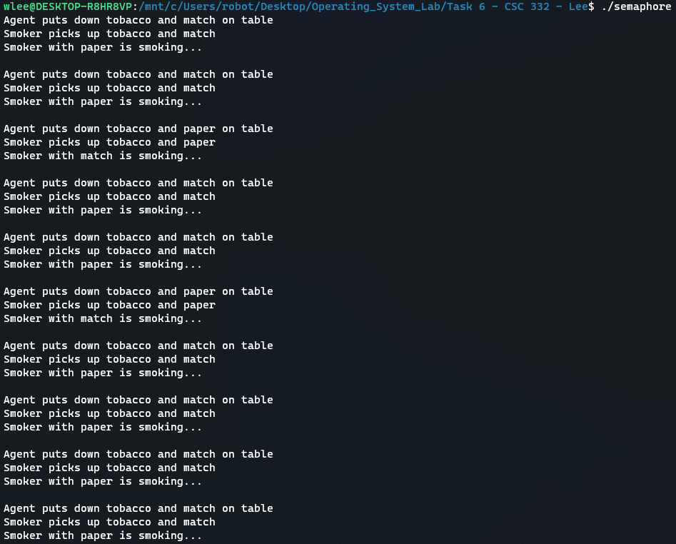
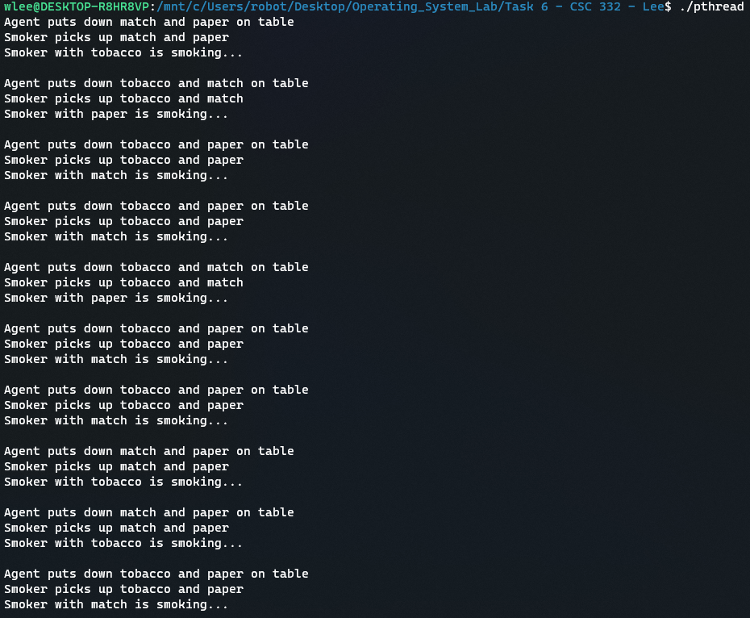

# Task 6 - Cigarette Smokers Problem
## William Lee 

Screenshot of Semaphore 

Screenshot of Pthread

As shown in both screenshots of the semaphore and pthread implementation, with proper waiting / locking and signalling/ unlocking the agent and smoker were able to run in the desirable execution order where the agent puts down two ingrediants and the smoker with the last ingrediant smokes. 
